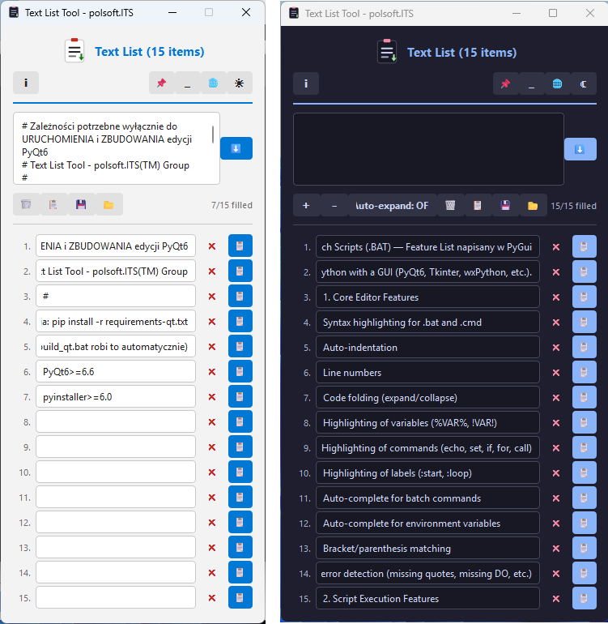

# 📋 Text List Tool

### Paste. Split. Copy. Done.

A lightweight, portable app for managing a list of 15 text snippets — no install, no dependencies, one single `.exe`.

**[⬇️ Download](#-download)** · **[✨ Features](#-features)** · **[🧩 Two editions](#-two-editions)** · **[🖥️ Screenshots](#️-screenshots)** · **[❓ FAQ](#-faq)**

---

## About

**Text List Tool** is a simple, fast utility for anyone who regularly copies and pastes repeatable bits of text — codes, links, comments, test data, canned replies, anything. Paste a block of text, the app splits it into 15 ready-to-edit entries, and you copy each one with a single click.

No installer. No account. No internet connection required. Run the `.exe` and it just works.

---

## ✨ Features

| | |
|---|---|
| 📋 **Split into list** | Paste any text and split it with one click (or `Ctrl+Enter`) into 15 separate, editable entries |
| 🖱️ **One-click copy** | Every entry has its own **Copy** button, with a visual confirmation |
| 📑 **Copy all** | Copy every non-empty entry at once, as a newline-separated list |
| ✕ **Per-item clear** | Clear a single entry without wiping the whole list |
| 🌗 **Light / dark theme** | Defaults to the **Catppuccin Mocha** dark theme, switchable with one button |
| 🌍 **EN / PL** | Full interface translation, switchable on the fly |
| 📌 **Always on top** | Pin the window above other apps |
| 🗕 **Compact mode** | Collapse the app into a small, draggable desktop icon |
| 💾 **Autosave** | List content, language, theme, and settings are remembered automatically between launches |
| 🖱️ **Context menu** | Cut / Copy / Paste / Select all via right-click |

---

## 🧩 Two editions

Text List Tool ships as **two independent builds** — same functionality, different GUI engine. Pick whichever looks/runs better on your system.

| | 🔵 **Tkinter** edition | 🟣 **PyQt6** edition |
|---|:---:|:---:|
| File | `lista_tekstow_tk.exe` | `lista_tekstow_qt.exe` |
| GUI engine | Python Tkinter (native) | PyQt6 |
| Look | Flat, lightweight | More polished, native OS context menus |
| File size | ~8–10 MB | ~25–35 MB (Qt is bundled inside) |
| Startup time | Instant | Slightly slower (Qt initialization) |
| Features | Identical in both editions | Identical in both editions |
| Theme / languages | Light/dark (Catppuccin Mocha), EN/PL | Light/dark (Catppuccin Mocha), EN/PL |

> 💡 Both editions save data to the same `text_list_data.json` format — feel free to switch between them, your list stays intact.

No strong preference? Start with the **Tkinter** edition — it's smaller and launches faster.

---

## 🖥️ Screenshots

> _Screenshot placeholder — add `screenshot-dark.png` / `screenshot-light.png` to the repository and swap in the links below._

| Dark theme (default) | Light theme |
|:---:|:---:|
|  |  |

---

## ⬇️ Download

| File | Description |
|---|---|
| [`lista_tekstow_tk.exe`](../../releases/latest) | **Tkinter** edition — smaller, faster startup |
| [`lista_tekstow_qt.exe`](../../releases/latest) | **PyQt6** edition — native OS context menus |

The app **requires no installation**. Download either `.exe`, run it from any folder (or a USB stick) — that's it. You can keep both editions side by side.

> 🛡️ Windows SmartScreen may show an "unknown publisher" warning on first launch (the app isn't code-signed). Click **"More info" → "Run anyway"**.

---

## 🚀 Quick start

1. Run `lista_tekstow_tk.exe`
2. Paste your text into the top field (each line becomes one entry)
3. Click **"Split into list ⬇"** (or press `Ctrl+Enter`)
4. Click **"Copy"** next to any entry — it goes straight to your clipboard

---

## ⌨️ Keyboard shortcuts

| Shortcut | Action |
|---|---|
| `Ctrl + Enter` | Split pasted text into the list |
| `Enter` (in an entry field) | Move to the next field |
| Right-click | Menu: Cut / Copy / Paste / Select all |
| Double-click the icon (compact mode) | Restore the main window |

---

## 💻 Requirements

- **OS:** Windows 10 or 11 (64-bit)
- **Additional software:** none in either edition — Python, libraries, and all dependencies (including Qt for the PyQt6 edition) are bundled inside the `.exe`
- **Disk space:** ~10 MB (Tkinter) / ~25–35 MB (PyQt6)
- **Permissions:** no administrator rights required

---

## 🔒 Privacy

Text List Tool runs **100% locally**. It doesn't connect to the internet, doesn't send any data, and contains no telemetry or ads. Your list is saved only to your own disk, in a `text_list_data.json` file next to the `.exe`.

---

## 🌍 Languages

- 🇬🇧 English
- 🇵🇱 Polski

The language switch sits in the top-right corner of the app — it takes effect instantly, no restart needed.

---

## ❓ FAQ

<b>Which edition should I pick — Tkinter or PyQt6?</b>
 

They're functionally identical. The **Tkinter** edition is smaller and starts faster — a good default choice. The **PyQt6** edition has native OS context menus (right-click) and slightly more polished styling, at the cost of a larger file size. Both use the same data file, so feel free to try both.

<b>Do I need Python installed?</b>
 

No. The app is packaged as a single, self-contained `.exe` — everything it needs is already inside.

<b>Where is my data saved?</b>
 

In a `text_list_data.json` file, in the same folder as the `.exe`. Copy it alongside the app to bring your list to another computer.

<b>Why does Windows show a SmartScreen warning?</b>
 

The file isn't signed with a code-signing certificate (the cost isn't justified for a free, non-commercial tool). The app is safe — you're welcome to review the source code.

<b>Can I use the app on two computers with the same list?</b>
 

Copy the `.exe` together with `text_list_data.json` to a USB stick or network drive — the list stays in sync manually (there's no automatic cloud sync).

---

## 📝 Changelog

### 1.0.0
- Initial release
- Two editions: **Tkinter** (`lista_tekstow_tk.exe`) and **PyQt6** (`lista_tekstow_qt.exe`), functionally identical
- Split pasted text into 15 editable entries
- Single and bulk copy
- Light / dark theme (Catppuccin Mocha)
- Full EN/PL localization
- Compact mode and "always on top"
- Autosave for content and settings

---

## 📄 License

**Freeware** — free for personal and commercial use. No warranty.

---

## 👤 Author

**Sebastian Januchowski** — polsoft.ITS™ Group

---

Made with 🖤 by **polsoft.ITS™ Group**

